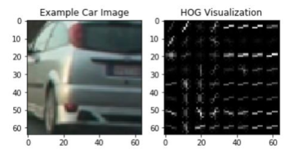
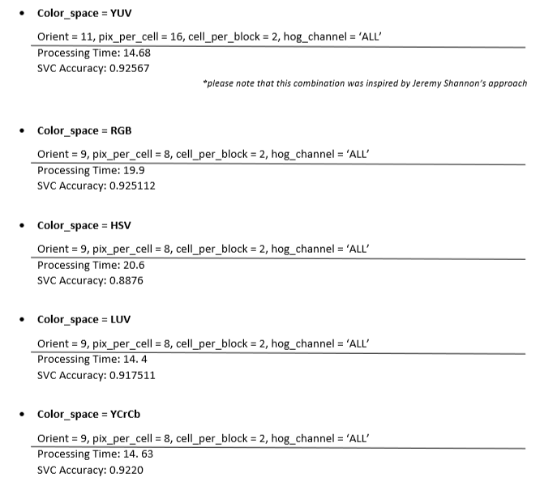
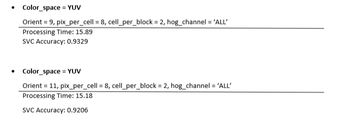
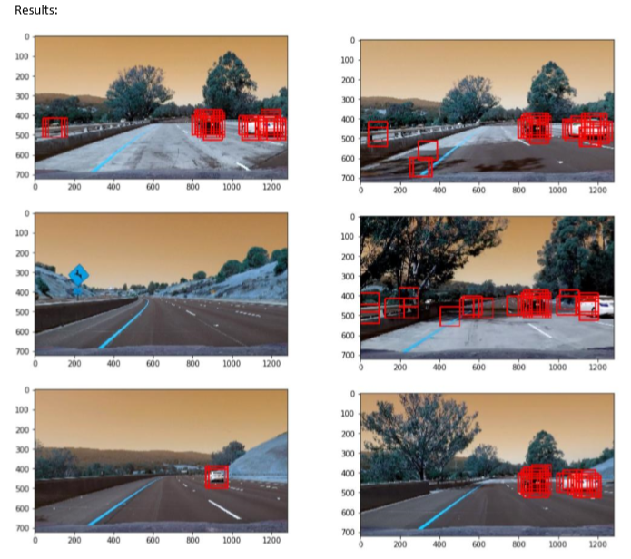
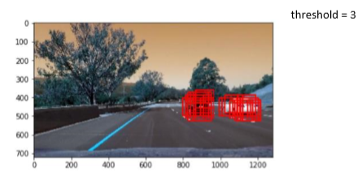
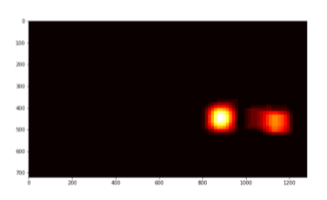
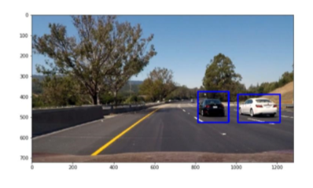
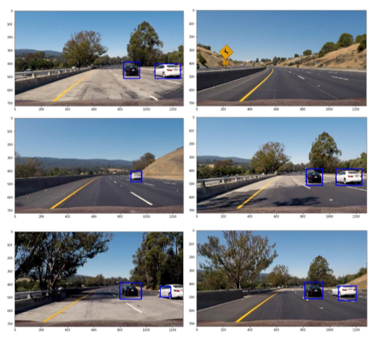

# CarND-VehicleDetection-P5
Vehicle Detection Project

### Vehicle Detection project 
The goals / steps of this project are the following:   

• Perform a Histogram of Oriented Gradients (HOG) feature extraction on a labeled training set of images and train a classifier Linear SVM classifier   
• Optionally, you can also apply a color transform and append binned color features, as well as histograms of color, to your HOG feature vector.   
• Note: for those first two steps don't forget to normalize your features and randomize a selection for training and testing.   
• Implement a sliding-window technique and use your trained classifier to search for vehicles in images.   
• Run your pipeline on a video stream (start with the test_video.mp4 and later implement on full project_video.mp4) and create a heat map of recurring detections frame by frame to reject outliers and follow detected vehicles.   
• Estimate a bounding box for vehicles detected.   

 Please find the code for the project at [Vehicle Detection.ipynd](https://github.com/efimiap/CarND-VehicleDetection-P5/blob/master/Vehicle%20Detection.ipynb)
 
 ### Histogram of Oriented Gradients (HOG)
 
 **1. Explain how (and identify where in your code) you extracted HOG features from the training images.**   
 Before I begin with the analysis of my project code, I would like to mention that I have used many of the  functions from the Udacity course, adapted respectively to produce the desired output.   
 
At first, I load the images I will use for training, on the first block of the code. To make sure they have been l oaded correctly, I print out the number of images: len(car_images) = 8792 , len(noncar_images)= 8968.   
On the next step, I define the function get_hog_features() which performs HOG feature extraction. Result:   

 

For feature extraction I have also used spatial and color, through the functions: bin_spatial() and color_hist(). The 3 feature extraction techniques are combined with the extract_features() function which can be used for either a list of image paths or for a single image. This is being achieved via a flag argument. The pre-mentioned functions can be found at: In [4].   

**2. Explain how you settled on your final choice of HOG parameters**   
To conclude on the optimal choice of HOG parameters, I tried out various combinations and compared them regarding the processing time and the SVC accuracy:

 

 

**Conclusion:**  
I decided to use **color_space YUV, orient = 9, pix_per_cell=8, cell_per_block=2, hog_channel=’ALL’** as it had the best accuracy at the time, compared to the other combinations. Please note that these numbers were the initial results from my testing the algorithms as they were provided in the lectures. After modifying the code, on the feature extraction combination I chose, I achieved:   
Processing Time: 13.87 SVC   
Accuracy: 0.986768 
 
### Sliding Window Search

**1.  Describe how (and identify where in your code) you implemented a sliding window search. How did you decide what scales to search and how much to overlap windows?**   
My pipeline for the sliding window search can be found on the blocks: 15 – 29. I have used many algorithms provided in the course. The most important step of this pipeline is that after I read the image using OpenCV and convert it to RGB, I normalize it. This is important because without the normalization my pipeline was detecting every window from the slide_window() region, when it was searching the images. After I normalize the images, I am detecting the bounding boxes in the images. The functions I use for that are:    
slide_window(): sets starting positions for the sliding windows search. In this manner, it is defining the region of interest in the image in which the search will occur. This function also loops through finding x and y window positions and returns the list of windows.  
search_windows(): this function takes as input the HOG parameters, the SVC and the list of windows. In combination with the single_img_features() function (which extracts the image HOG, spatial and hist features), it predicts the window location using my classifier and saves the window.   
draw_boxes(): this function draws the bounding boxes in the original image show_img(): this function outputs the resulting image. 

 

In these images we can see a large number of outliers and false positives. To correct this, I drew a heatmap in the detected bounding boxes. The step by step results are:  

 

 

Final output:  

 

**2. Show some examples of test images to demonstrate how your pipeline is working. What did you do to optimize the performance of your classifier?**    
To optimize the performance of the classifier, I normalized the images, used the heatmap method on the detected bounding boxes from sliding windows and chose the parameters through the “trial and error” method, until I found the optimal combination of the input arguments. I tried different values on the region of interest on the sliding windows, the xy_window and as described before, the parameters for the HOG extraction step. The final results:  

 

### Video Implementation
The video output can be found at [test_video_out.mp4](https://github.com/efimiap/CarND-VehicleDetection-P5/blob/master/test_video_out.mp4) and [project_video_out.mp4](https://github.com/efimiap/CarND-VehicleDetection-P5/blob/master/project_video_out.mp4)   
As described before, to minimize false positives, I used the heatmap, label and threshold approach in the pipeline. The threshold after different tries, I found it to be optimal at the value:   
threshold = 3. 

### Discussion
**1. Briefly discuss any problems / issues you faced in your implementation of this project. Where will your pipeline likely fail? What could you do to make it more robust?**  
The problems I found when developing this pipeline were:   
1.  The type of input image and the image scaling, as it was predicted in the lectures   
2.  Execution speed. It takes around 10 minutes to process the test video ..   
3.  Detection accuracy. Different perceptual conditions might affect the detection   

Increase robustness:   
1. Implement HOG_subsampling to optimize the performance of the classifier   
2. Implement tracking: keep the Information from the previous frame   
3. To reduce the execution speed, we can drop every second frame   
